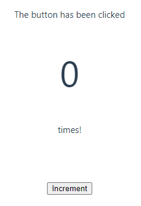
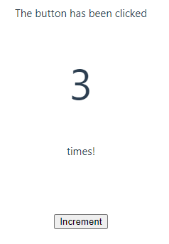
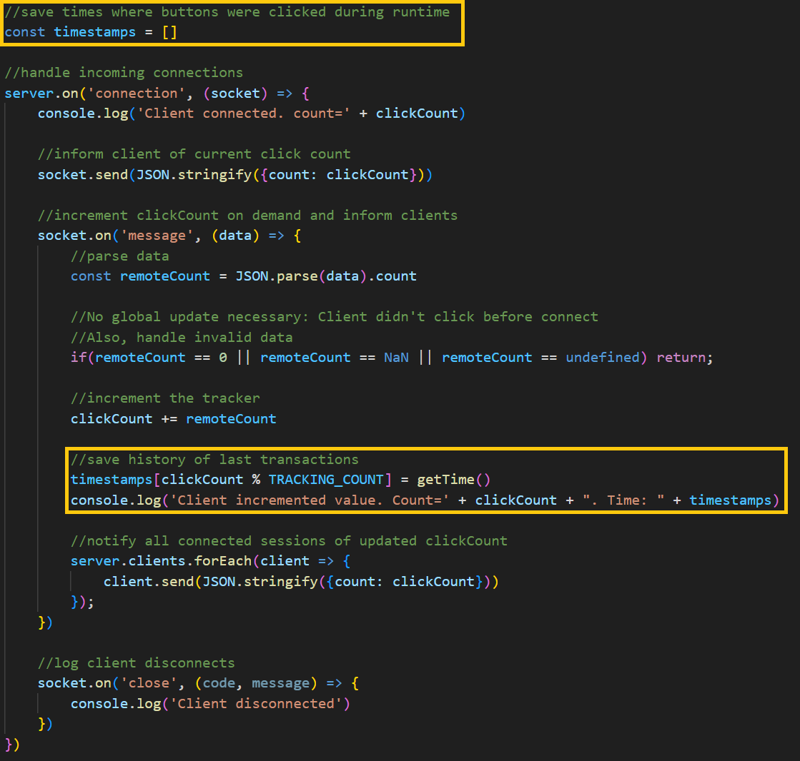

# Siemens-Energy Lab: Coding Challenge

Coding challenge for recriutment at Siemens in 2023.

# Usage

## Client
In order to start using the client, change to the client directory
```sh
cd ./client
```
### Client Setup

```sh
npm install
```

### Compile and Hot-Reload for Development

```sh
npm run dev
```

### Type-Check, Compile and Minify for Production

```sh
npm run build
```

### Run Unit Tests with [Vitest](https://vitest.dev/)

```sh
npm run test:unit
```

### Lint with [ESLint](https://eslint.org/)

```sh
npm run lint
```

## Server
In order to start using the server, change to the server directory
```sh
cd ./server
```

### Server Setup

```sh
npm install
```

### Start the server

```sh
node ./server.js
```

# Objectives
Following requirements had to be met:

- [x] When the page is loaded, the app queries the current counter value from the backend.


I've taken the liberty to not precisely implement this requirement for the sake of efficiency. Initially, the clients request must travel to the server, which needs to be processed and returned. Insted, the server instantly sends the current click count once a client connects.

- [x] There should be a button that allows the user to increase the counter value by 1 every time it is hit.



- [x] The displayed counter value should be updated.



- [x] All users that are on the page should always see the current value.
- [x] When another user enters the site, the current counter value is shown.


- [x] The application should store a history of the last 5 timestamps when the counter was increased. However, they must not be shown to the user.
- [x] Storing data only during runtime is enough.

